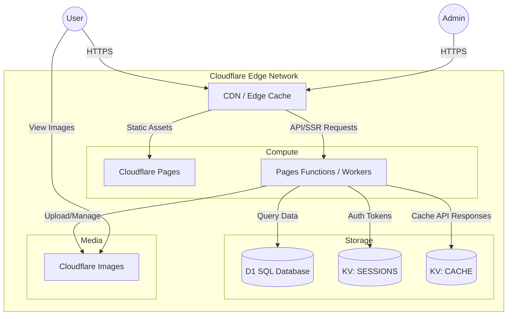
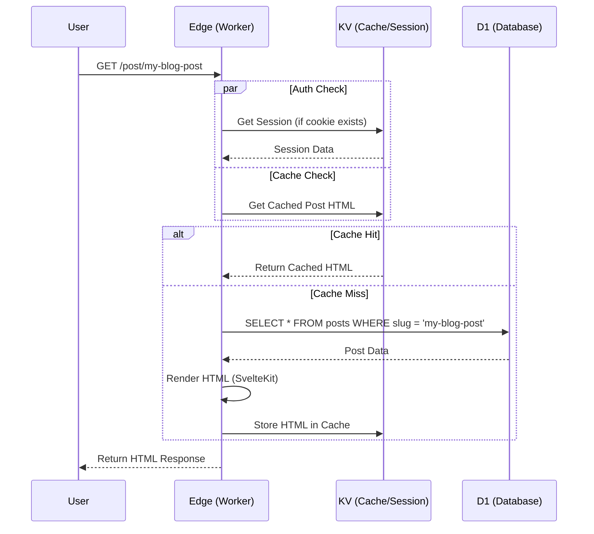
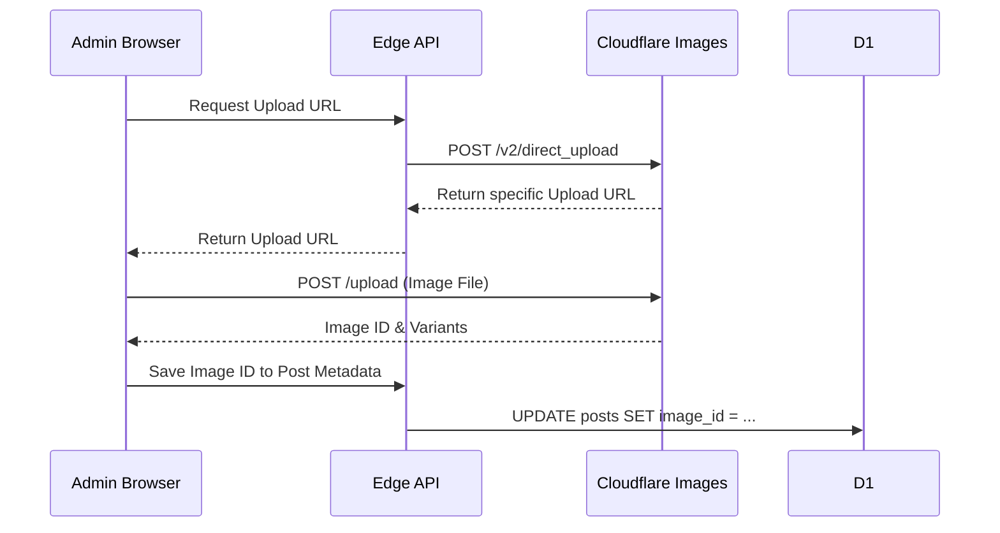

# EdgePress Architecture Guide

This document provides a comprehensive overview of the EdgePress architecture, detailing how it leverages Cloudflare's serverless infrastructure to deliver a high-performance, scalable blog platform.

## 🏗 High-Level Architecture

EdgePress is a serverless application built on **SvelteKit** and deployed to **Cloudflare Pages**. It utilizes a suite of Cloudflare services to handle compute, storage, caching, and media delivery at the edge.

### System Context Diagram

## 🧩 Infrastructure Components

### 1. Compute: Cloudflare Pages & Functions

- **Service**: [Cloudflare Pages](https://pages.cloudflare.com/)
- **Role**: Hosts the frontend static assets and executes server-side logic via Pages Functions (which are built on Cloudflare Workers).
- **Configuration**: SvelteKit is configured with `@sveltejs/adapter-cloudflare` to build the application into a format compatible with Pages.
- **Routing**: SvelteKit handles routing. Static routes are served directly from the CDN, while dynamic routes are server-side rendered (SSR) by Functions.

### 2. Database: Cloudflare D1

- **Service**: [Cloudflare D1](https://developers.cloudflare.com/d1/)
- **Role**: Primary relational database.
- **Binding**: `DB`
- **Usage**: Stores structured data such as:
  - Blog posts (content, metadata, slugs)
  - Users (admin profiles)
  - Settings (site configuration)
  - Tags/Categories
- **Why D1?**: It provides a familiar SQL interface (SQLite) but is distributed globally, reducing read latency by moving data closer to the user.

### 3. Key-Value Storage: Cloudflare KV

- **Service**: [Cloudflare Workers KV](https://developers.cloudflare.com/kv/)
- **Role**: Low-latency key-value storage for high-read, low-write data.
- **Namespaces**:
  - `SESSIONS`: Stores active session tokens and associated user metadata for authentication. This allows for fast session validation without hitting the D1 database on every request.
  - `CACHE`: Used for caching expensive API responses or computed data (e.g., rendered markdown, complex queries) to improve performance.

### 4. Media: Cloudflare Images

- **Service**: [Cloudflare Images](https://developers.cloudflare.com/images/)
- **Role**: Storage, optimization, and delivery of image assets.
- **Integration**:
  - **Upload**: Admin interface uploads images directly to Cloudflare Images via signed URLs or API.
  - **Delivery**: Images are served via Cloudflare's global network, automatically optimized for the user's device and browser (e.g., serving WebP/AVIF).
  - **Configuration**:
    - `CF_IMAGES_TOKEN`: Secret for API access.
    - `CF_IMAGES_HASH`: Public hash for constructing image URLs.

## 🔄 Data Flow Patterns

### Request Lifecycle (Server-Side Rendered Page)

### Image Upload Flow

## 🔐 Security & Secrets

Sensitive information is managed via Cloudflare Secrets and Environment Variables:

- **Secrets** (encrypted, not in code):
  - `CF_IMAGES_TOKEN`: Authentication for Image API operations.
  - `JWT_SECRET`: Key for signing and verifying JSON Web Tokens (if used alongside sessions).
- **Environment Variables** (public/configuration):
  - `CF_ACCOUNT_ID`: Cloudflare Account ID for resource addressing.
  - `CF_IMAGES_HASH`: Used to construct public image URLs.

## 🚀 Deployment Pipeline

1.  **Code Change**: Developer pushes code to the git repository.
2.  **Build**: Cloudflare Pages system detects the change.
3.  **Install & Build**: `npm install` and `npm run build` are executed.
    - SvelteKit compiles the application.
    - The Cloudflare Adapter generates the `_worker.js` and static assets.
4.  **Deploy**:
    - Static assets are uploaded to the Pages CDN.
    - The worker script is deployed to the global edge network.
    - Bindings (D1, KV) are linked to the production environment.
